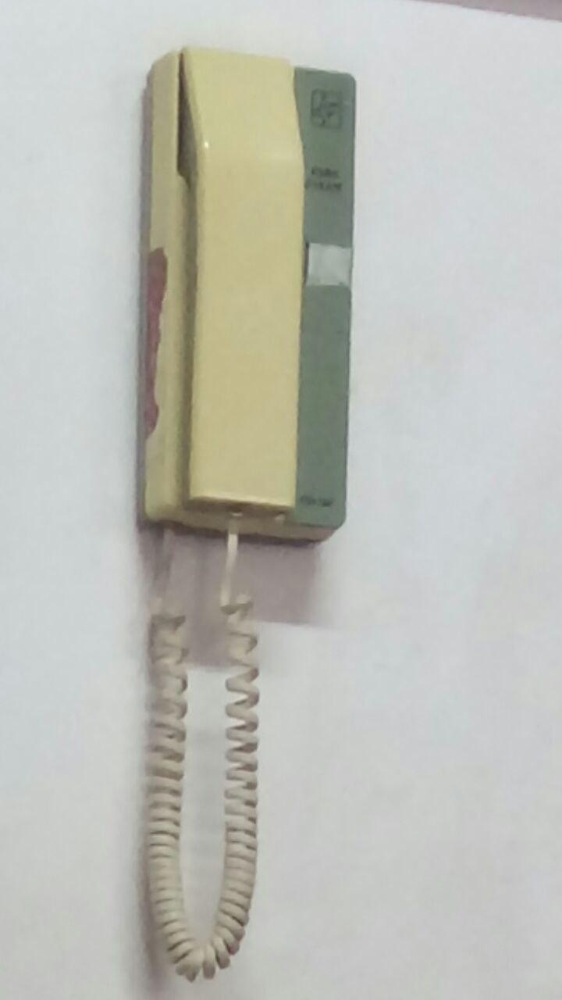
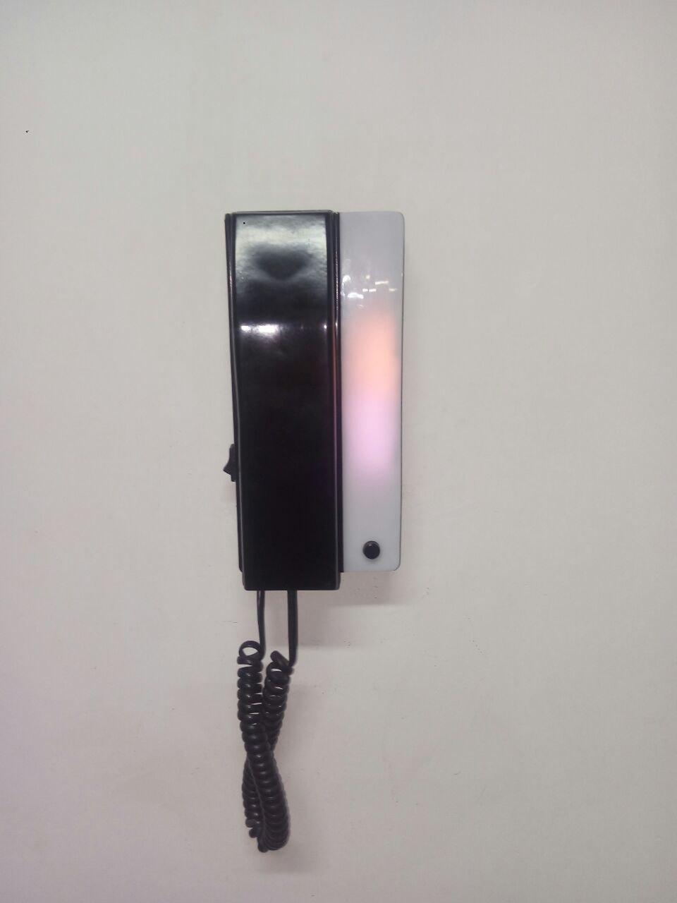
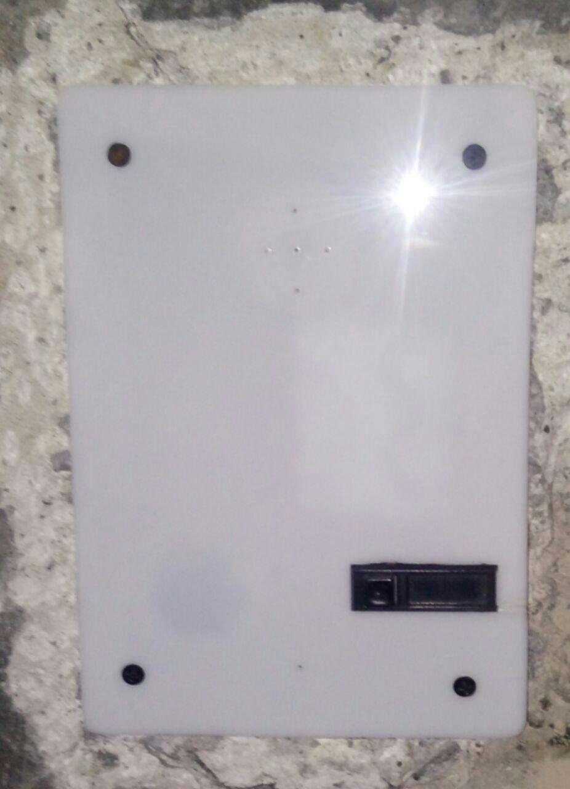

# RFID_door_controller

this is a simple door controller I build for my house!

# Materials
1. Arduino UNO
2. MFRC522 
3. a transistor ( I used a random NPN one) and a `1N4007` diode 
4. Relay (I used a 12v one, but 5-6 is prefered)
5. some wires and connectors
6. some white plexyglass (a 30*20 sheet was more than enough for me)
7. swiches and toggle keys 
8. an old door controller to destroy (I used its door opener module and plastic frame)
9. a 9v DC adapter (because I'm using a 12v relay, I know I should've used a 12v adapter, but it's working fine)
10. some LEDs
11. two 8ohm speaker(also 5v buzzer would be good)
12. MIC (for future developments!)
13. a spray can (optional)

# Circuit Diagram 

# Pictures
before:

After:

 
